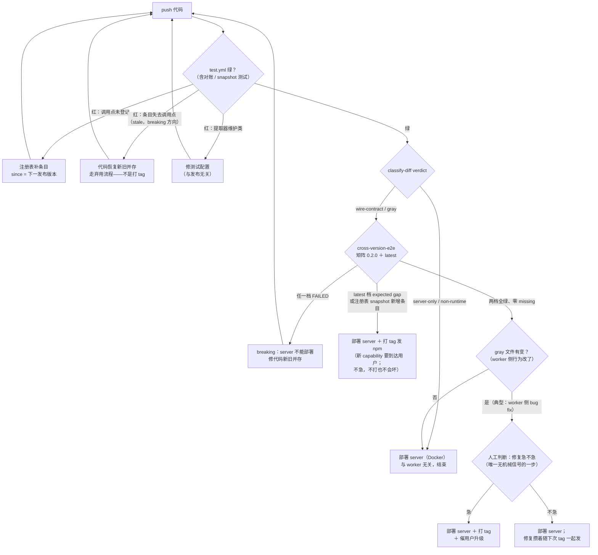

# Server / Worker 版本兼容方案（同包异端部署）

> 状态：**部分实现**（设计 2026-08-03，§7 前四步同日实现于 dev3）。
> 已落地：Phase 1 版本握手 + `remote_servers` 版本列（§2）、capability 注册表 +
> 双向对账测试（wrapper 清单两向校验 + buildTargetCall 路径收割）+ snapshot
> （§3.1，`reverse-connect-capabilities.ts` / `.test.ts`）、路径分类脚本
> （§3.3，`scripts/classify-diff.mjs`）、注册表驱动的跨版本 e2e（§4.2，
> `scripts/cross-version-e2e.mjs`：56 个 capability 均有受校验的覆盖决策——
> 36 个跨版本实测冒烟、15 个由 CI 路由测试覆盖（指针受校验）、5 个显式豁免；
> 对 npm 0.2.0 与 0.3.2 均真实 PASS，404 按 capability `since` 逐项判定）、
> CI（`.github/workflows/worker-compat.yml` 矩阵 {0.2.0, latest}；注册表测试
> 随 `test.yml` 自动跑）。经验兼容下限 = **0.2.0**（0.1.x 无反向连接，连不上）。
> 未实现：§2 Phase 2–4（上报随下一次 npm 发布生效；观察/拒连未启用）、
> §3.2 Zod 契约、§4.3 金丝雀、§4.4 平台矩阵、UI 升级角标/版本分布页。
>
> 实现修正一则：status 帧在 open 时发送，可能早于 hub 握手监听器挂载而丢失，
> 因此 version/capabilities 同时携带在 `machine_auth` 帧上（可靠载体），
> status 帧仅作旁路暂存 —— 见 `reverse-connect-types.ts` 注释。
> 背景：server（SaaS，持续部署）与 worker（`vibedeckx connect`，跑在**用户自己的机器上**）
> 共用同一个 npm 包。server 版本完全受控、随时可发；worker 版本不受控、落后程度任意。
> 本文回答两个日常问题，并给出配套的机械判断手段与测试方案：
>
> 1. **兼容性**：旧 worker 对上新 server 会不会坏？（会坏 → 必须等 worker 升级 / 走弃用流程）
> 2. **到达性**：这次改动的行为是否发生在 worker 上？（是 → 不升级 worker 则新功能不生效，但不坏）

---

## 1. 兼容契约面：三层，不止是帧 schema

隧道协议的"契约"由三层组成，**只盯传输层是不够的**：

| 层 | 内容 | 现状 |
|---|---|---|
| 传输层 | 控制帧信封（`http_request` / `ws_open` / `status` / `machine_*` 等 union） | `src/reverse-connect-types.ts`，纯 TS interface，两端 `JSON.parse(...) as ControlFrame` 裸转，无运行时校验 |
| 应用层 HTTP 面 | 所有经 `proxyToRemoteAuto` 发向 worker 的 `method + path` 集合 | 散落在各 routes 文件（如 `remote-server-routes.ts` 代理 `/api/mkdir` → worker 必须实现该路由） |
| 应用层 WS 面 | 所有经 `ws_open` 打开的虚拟通道 path 及其消息语义 | 散落在调用点 |

关键认识：`HttpRequestFrame` 只是个信封，携带任意 `method/path`
（`reverse-connect-types.ts:12`）。**新增一个被代理的路由不会改变任何帧 schema**，
旧的帧级 fixture 照样通过，但旧 worker 对该路由返回 404。这类改动正是最常见的改动，
所以机械判断必须覆盖应用层面（见 §3 capability 注册表）。

### 协议纪律（写进 CLAUDE.md 的规则）

- 隧道上的一切（帧字段、代理路由、虚拟通道消息）**只做加法**：新增字段/路由/通道，
  老 worker 忽略或 404，server 按 capability 降级（§3.1）。
- 改名、删除、改语义 = **breaking**，必须走弃用流程：新旧并存 ≥ 一个弃用期 →
  观察版本分布（§2.4）→ 提高 `MIN_WORKER_VERSION`。

---

## 2. 版本握手与兼容下限（分阶段迁移）

### 现状约束（决定了不能一步到位）

- worker 连上后只发 `{type:"status", ready:true}`（`reverse-connect-client.ts` open 回调），
  不带版本。
- server 对不做机器身份握手的旧 worker 有 5s 超时的 legacy 注册路径
  （`reverse-connect-routes.ts` `registerUnauthenticated`）。
- `RemoteServer` 模型（`storage/types.ts`）**没有版本字段**。

因此新 server 上线首日，全部存量 worker 都是 version=unknown。若把 unknown 视同
低于下限，首次部署就拒掉所有存量 worker；若永远容忍 unknown，下限又永远无法执行。
必须分阶段：

### Phase 1 — server 先行（接受 unknown）

- `StatusFrame` 扩展**可选**字段：`version?: string`、`capabilities?: string[]`。
  旧 worker 不发，server 容忍。
- 版本持久化到 `remote_servers` 表新增列：`worker_version` / `worker_capabilities` /
  `worker_version_reported_at`。**存 remote_servers 而不是 executor**——连接按
  `remoteServerId` 注册，存这里才覆盖无 executor 的在线 worker、离线 worker 与历史值。
- server 端定义 `MIN_WORKER_VERSION` 常量，此阶段**只作警告线**，不拒连。

### Phase 2 — worker 上报（随下一个 npm 发布）

- 新版 worker 在 status 帧里带上 `version`（取自 package.json）与 capability 列表。

### Phase 3 — 观察

- 版本分布页（基于 `remote_servers` 数据）：各版本在线/离线数量、unknown 占比。
- unknown 或低于警告线的 worker：UI 上该 remote 显示"建议升级"角标 + 升级命令。
  不拒绝。

### Phase 4 — 执行（unknown 退场）

- 退场条件（两者同时满足才启用拒连）：
  1. unknown 占比 < 5%（阈值可调）；
  2. 距 Phase 2 发布 ≥ 一个弃用期（建议 60 天）。
- 启用后：低于 `MIN_WORKER_VERSION` **或 unknown** → 拒连，关闭码带明确升级指引
  （复用现有 4001/4003 风格的 close-reason 提示）。

---

## 3. 开发时机械判断

### 3.1 Capability 注册表（核心手段）

单一模块（如 `src/reverse-connect-capabilities.ts`）登记每一个"server 会调用的
worker 路由/通道"：

```ts
export const WORKER_CAPABILITIES = {
  "http:POST /api/mkdir":   { since: "0.x.y", summary: "远程创建目录" },
  "http:GET /api/browse":   { since: "0.x.y", summary: "远程目录浏览" },
  "ws:/api/process-log":    { since: "0.x.y", summary: "进程日志流" },
  // ...
} as const;
```

配套强制手段：

- **调用点对账（CI 静态检查）**：grep/lint 断言所有 `proxyToRemoteAuto(...)` 的
  `method+path` 与所有 `ws_open` 的 path 都能在注册表中找到；找不到即 CI 红。
- **注册表 snapshot**：注册表本身做 snapshot 测试。新增条目 = additive（PR 须确认
  server 对缺失该 capability 的老 worker 有降级/404 容忍）；修改或删除条目 =
  breaking，触发 §1 弃用流程。
- server 侧新功能调用新路由前，检查对端上报的 capabilities（Phase 2 之后可用；
  之前按"unknown = 只具备基线能力"处理）。

### 3.2 传输层 Zod 契约（新建，不是已有）

现状是 TS interface + 裸 `as` 转型。**新建** Zod schema（对齐
`reverse-connect-types.ts` 的 union），在两端 `JSON.parse` 解析点接入
safeParse，并对 schema 面做 snapshot。定位：抓帧结构漂移；**不承诺**抓字段语义
变化——语义靠 §4 的真实跨版本 e2e。

### 3.3 路径分类脚本（辅助信号）

对 `git diff --name-only` 分桶，输出参考结论：

| 桶 | 规则 | 结论 |
|---|---|---|
| server-only 确定 | 仅 `apps/vibedeckx-ui/` | worker 无 UI（API-only），server 单独发 |
| wire-contract | `reverse-connect-*.ts`、`utils/remote-proxy.ts`、`virtual-ws-adapter.ts`、capability 注册表 | 协议变更，走 §3.1/§1 流程 |
| worker-behavior / 灰区 | **所有 remote proxy 调用点、providers/、protocol/、agent-session-manager、process-manager 及其余共用代码** | 保守归灰区，靠注册表对账 + §4 测试回答，**不假装文件位置能回答语义问题** |

落地形态：

- 位置：`scripts/classify-diff.mjs`（纯 Node，无依赖），规则表（glob → 桶）写在
  脚本顶部，与上表保持同步。
- 触发：手动 `node scripts/classify-diff.mjs [base-ref]`（默认 `origin/main`，
  适用于在 dev 分支上合并前预看）；CI 上作为 job 跑，结果写进 job summary。
  base 按事件选：PR 事件用 PR base；**push main 事件用上一个发布 tag**
  （`git describe --tags --match 'v*'`）。理由：本项目流程是本地 merge 后直推
  main、不走 PR，origin/main 当 base 恒为空 diff；而每次 npm 发版都打 `v*` tag，
  拿它当 base 正好回答"**自上次 worker 发布以来积累了哪些 worker 可达改动**"——
  gray/wire-contract 信号在每次 push 的 summary 里持续出现，直到打 tag 发出去
  才清零，等于常驻的"worker 发版欠账表"。兜底链：无 tag → `event.before` →
  `HEAD~1`。
- 输出：逐文件桶归属 + 一行结论，例如：

  ```
  server-only     apps/vibedeckx-ui/components/agent/agent-message.tsx
  wire-contract   packages/vibedeckx/src/reverse-connect-types.ts
  gray            packages/vibedeckx/src/agent-session-manager.ts

  verdict: wire-contract touched — capability 注册表须有对应变更（§3.1）；
           gray 文件走人工/AI 复核
  ```

- 与 §3.1 的关系：脚本只看文件路径，是**快信号**；真正的强制力在注册表对账
  （调用点 grep 断言）。脚本的 `wire-contract` 桶命中而注册表 snapshot 未变时
  只警告不拦截（可能只是重构）；注册表对账失败才拦截。

日常判断口径：**"这次改动对隧道契约（三层）是加法还是减法？"** 加法 → server
单独发，老 worker 只是用不上新功能；减法/改法 → 走弃用流程。

---

## 4. 测试方案（四层，由快到慢）

### 4.1 离线契约测试（每 PR，秒级）

沿用 `src/protocol/` 对 CLI 的 fixture 做法：为每个已发布版本录制隧道帧 fixture，
用当前 Zod schema 校验旧 fixture 仍可解析。承诺范围：**结构可解析**，不含语义。

### 4.2 跨版本 e2e（每 PR 或发布前，CI 内，无需专门机器）

注意 `connect` 的真实参数要求：`--connect-to` 必选（`command.ts` connectCommand），
token 缺失直接抛错（`connect-daemon.ts` `resolveConnectToken`）。可执行骨架：

```bash
# 1. 起本分支构建的 server（隔离数据目录、随机端口）
node packages/vibedeckx/dist/bin.js --port $SERVER_PORT --data-dir $(mktemp -d) &
SERVER_PID=$!

# 2. 经 API 创建 remote server 记录并领取 connect token
#    （POST /api/remote-servers → id；从创建响应/token 端点读 connect_token）

# 3. 全参数起旧版本 worker（前台，隔离数据目录，不用 --daemon）
npx -y vibedeckx@$MIN_WORKER_VERSION connect \
  --connect-to "http://localhost:$SERVER_PORT" \
  --token "$TOKEN" --data-dir $(mktemp -d) --port $WORKER_PORT &
WORKER_PID=$!

# 4. 轮询 GET /api/remote-servers/:id 直到 status=online（带超时）
# 5. 按 §3.1 注册表逐 capability 冒烟：每个条目至少一次真实请求，
#    断言非 404 且语义正确；外加远程会话一轮、隧道 WS 流、断线重连
# 6. kill $WORKER_PID $SERVER_PID；清理 mktemp 目录。绝不使用 connect stop
```

矩阵两个点：兼容下限（当前钉在 **0.2.0**，`MIN_WORKER_VERSION` 提升时同步移动）
与 `latestReleased`。

已实现形态（`scripts/cross-version-e2e.mjs`）——**注册表驱动**，56 个 capability
必须严格分区为三类之一，分区两向校验（新增条目未做覆盖决定 → FAIL）：

- **36 个实测冒烟**：文件组、git/worktree 组、executor 组 + 日志 WS 通道、终端、
  搜索、同步执行、browse/mkdir、断线重连，以及**完整 agent 会话 round**——靠
  worker PATH 上注入的 stub `claude`（最小 stream-json:init→assistant→result）
  驱动 find/create(new)/list/get/message/**会话流 WS**/paste/title/favorite/
  restart/stop/delete + workflow 列表。
- **15 个 COVERED_BY**：指向 CI（test.yml）实际执行的路由级测试文件
  （switch-mode、accept-plan、model、branch、cross-remote×5、outbox、workflow
  create/gate/cancel/reviewer-candidate、executor running）。指针受校验：文件
  必须存在且包含标记串，指针失效 → FAIL。
- **5 个硬豁免**（各带具体缺失夹具的理由）：workflow 单条读取、approve（skip-
  permissions 下不产生审批）、agent-type（切 codex 会真下载二进制）、terminal
  send（仅 LLM 工具可驱动）、browser 透传。

404 策略按 **capability `since` 逐项判定**（无全局开关）：被测 worker 版本早于
该 capability 的 `since` → 预期缺口，容忍并报告；worker 理应支持却 404 → 判为
breaking，FAIL。`--worker-bin` 自测（当前分支即最新）404 一律 FAIL。`since`
基线 = 0.2.0（最早能反向连接的发布版），晚引入的路由用发布版探测钉准
（如 outbox=0.2.16）。

### 4.3 常驻金丝雀 worker（唯一的常驻资源，一个容器即可）

> 金丝雀同时是 server 部署可靠性演进的第一档观测手段，见
> `server-upgrade-reliability-design.md`。

固定跑 `MIN_WORKER_VERSION`，连 staging（或测试账号连生产），长期在线。测 CI
测不了的：**server 部署瞬间旧 worker 能否干净重连**、auth backoff、daemon 长期
存活（参考 reverse-connect auth backoff 一类只有长连接才暴露的问题）。部署后
掉线不恢复 → 告警。

### 4.4 平台安装矩阵（发布时）

ubuntu-22.04 / ubuntu-24.04 / macOS 的 CI runner 各跑一次 `npm install + connect`
冒烟，覆盖 glibc / prebuilt 原生模块差异（better-sqlite3、node-pty）。这是
"多机器"需求的正确形态——临时 CI runner，**不需要常驻旧版本机器**：版本隔离
靠 `npx vibedeckx@<ver>` + 独立 `--data-dir`，不靠机器隔离。

---

## 5. 运维闭环与发布 checklist

- worker 侧：`connect status` 已有 npm 最新版检查；追加 daemon 定期自查提示，
  可选 opt-in 自动更新。worker 平均落后越少，兼容窗口越短。
- 发布 checklist：
  1. §3.1 注册表 snapshot 无 breaking（或已走弃用流程）；
  2. §4.2 跨版本矩阵绿；
  3. 部署；
  4. §4.3 金丝雀重连正常。

## 6. 日常操作手册（建成之后）

设计目标：检查全部挂在 CI 上，开发者**不需要主动跑任何东西**，只在信号变红时
响应。"更新 worker"对运维者来说是两个动作——**发一版 npm** + **要不要催用户
升级**；下面的决策流回答的就是这两件事。

### 6.1 "改了一个东西，要不要更新 worker？"决策流

看 PR 上的两个机械信号（classify-diff comment + 注册表 snapshot diff）：

1. **classify-diff 只命中 `server-only` 桶**（纯 UI/server 路由）→ 不发 npm，
   与 worker 无关，server 直接部署。结束。
2. **注册表 snapshot 没变、灰区文件也没动** → 同上，server 单独发。
3. **注册表新增条目（加法）** → worker 不更新**不会坏**，只是新功能对老 worker
   不可用（server 走降级分支）。操作：发 npm，UI"建议升级"角标慢慢催，不强制。
4. **注册表修改/删除条目（减法/改法）** → breaking。流程会拦住"直接改"：代码
   必须先改成新旧并存 → 发 npm → 过弃用期 → 看版本分布 → bump
   `MIN_WORKER_VERSION`。**"必须立即更 worker 否则会坏"的状态在流程上被消灭**，
   breaking 被拉长成有缓冲的迁移。
5. **灰区文件变了、注册表没变**（典型：修 `agent-session-manager.ts` 的 bug）→
   老 worker 完全兼容，只是带着旧 bug 继续跑。这是**唯一留给人（或 AI 复核）的
   判断**，且内容从"会不会坏"降级成"急不急"：重要修复 → 发 npm + 催升级；
   不重要 → 攒着下次一起发。

| PR 信号 | 会坏吗 | 动作 |
|---|---|---|
| server-only 桶 | 不会 | server 直接发，与 worker 无关 |
| 注册表新增条目 | 不会 | 发 npm；UI 角标慢慢催，不强制 |
| 注册表删改条目 | 弃用期后才会 | 并存 → 弃用期 → bump 下限流程 |
| 灰区变、注册表没变 | 不会 | 只判断"修复急不急"决定发版节奏 |

兜底：判断错了，§4.2 跨版本 e2e 在部署前红给你看，§4.3 金丝雀在部署后告警。
最坏后果是 CI 红一次，不是用户的 worker 悄悄坏掉。各检查的具体输出怎么读、
tag 怎么决策，见 §6.5 检测手册。

### 6.2 开发者日常操作（响应式，非主动）

| 场景 | 要做的 |
|---|---|
| 日常改动 | 无；push 后等 CI |
| 对账测试红（调用点不在注册表） | 注册表补一行条目 |
| snapshot 测试红（注册表/schema 变了） | 确认是加法直接过；是删改则改成新旧并存 |
| 新 capability 功能 | 写降级分支（见 6.3） |
| server 部署 | 看 CI 绿 → 部署 → 瞄金丝雀告警 |
| npm 发版 | 手动触发平台矩阵 job（§4.4） |

本地想提前知道结果：`node scripts/classify-diff.mjs` 或跑对账/snapshot 两个
vitest——**可选，CI 兜底**。更省事的方式是 `/compat-check` skill
（`.claude/skills/compat-check/`）：按 §6.5 流程自动跑检查并给出分支结论。

### 6.3 唯一自动化不了的编码习惯

server 调用新 capability 前查对端 `capabilities`、给老 worker 写降级分支。CI 能
发现"你调了个新路由"，判断不了"你有没有处理老 worker 调不通"。落地方式：

- 规则写进 **CLAUDE.md**（大部分代码由 coding agent 写，规则进 CLAUDE.md 即进
  每个 agent 的上下文）；
- PR 的注册表 diff 是人工提醒信号：看到新增条目，review 时确认降级分支存在。

### 6.4 流程变化总览

- **开发**："要不要更 remote"从临场分析变成读 PR 机械结论；加协议面功能多一次
  注册表登记（CI 红了补一行）和一个降级分支；直接删改旧协议被流程堵死。
- **发布**：server 部署与 npm 发版解耦成两种节奏——server 可日发，npm 只在
  worker 侧行为/新 capability 需要到达用户时发。
- **运维**：多一个金丝雀容器要接告警、一张版本分布页要看；提高兼容下限从拍脑袋
  变成"看分布 → 公告 → 弃用期 → bump"的流程化操作。
- **过渡期提醒**：Phase 1–3 期间 `MIN_WORKER_VERSION` 只是警告线，拒连到 Phase 4
  才启用——开发侧约束（注册表、降级分支）先生效，运维侧强制力（拒连）后生效，
  设计使然。

### 6.5 检测手册：push 之后看什么、怎么读输出

发布机制前提：**server = Docker 镜像随时构建部署，与版本号无关；worker = 创建
git tag → GitHub Action 构建发布 npm 包**。所以"要不要更新 worker"落到操作上
就是"要不要打 tag"。

三套检查的位置（常见误解：对账测试**不在** worker-compat 里）：

| 检查 | 在哪跑 | 时机 | 回答的问题 |
|---|---|---|---|
| 对账 + snapshot 测试（`reverse-connect-capabilities.test.ts`） | `test.yml`，随全量 vitest | 每次 push / 本地 | 这次改动**是不是**协议变更 |
| classify-diff（job summary） | `worker-compat.yml` | 每次 push | 改动碰了哪类文件 |
| cross-version-e2e 矩阵 {0.2.0, latest} | `worker-compat.yml` | 每次 push | 旧 worker **会不会坏**；新功能**到没到** |

#### push 后的阅读顺序

1. **test.yml 绿不绿**。红了先修——这是开发问题，不是发布问题。三种红：
   - **调用点不在注册表** → 补一行条目，`since` 填**下一个要发布的版本号**。
     这一步就在强迫你想清楚该功能随哪个 tag 发出去。
   - **注册表条目失去调用点（stale）** → 你删/改了旧调用，breaking 方向。修法
     是代码恢复新旧并存、走弃用流程——**这时打 tag 是错误反应**，发新 worker
     救不了 fleet 里不升级的存量。
   - **提取器维护类**（新 wrapper 不在 `HTTP_SENDER_NAMES` 清单等）→ 修测试
     配置，与发布无关。

   注意：**worker 侧 bug 修复不会让对账测试红**（调用面没变），它属于下面第 4 步。

2. **classify-diff 的 verdict 行**（job summary）：

   ```
   verdict: server-only / non-runtime — safe to deploy the server alone; no worker release needed.
   ```
   → 直接部署 server，结束。

   ```
   verdict: wire-contract touched — tunnel protocol change: the capability registry must reflect it (§3.1);
            gray files touched — worker-reachable code: review whether the change must reach workers (npm release) or is server-only.
   ```
   → 注意 gray 的措辞是 "review whether"——它只知道"碰了 worker 可达代码"，
   判断不了语义，进第 4 步。

3. **cross-version-e2e 两档的关键行**：

   - `[xver] smoke X: FAILED — ...` / 结尾 `FAIL` → **breaking，server 不能部署**。
     修法是代码新旧并存，不是打 tag。
   - `[xver] smoke X: 404 — worker@<ver> predates <capability> (expected gap)` +
     结尾 `missing on this version` 列表 → 出现在 **latest 档**时，就是"该打
     tag"的执行信号：你新增的 capability 连最新发布版 worker 都没有，打 tag 前
     该功能对所有用户不可用。出现在 **floor（0.2.0）档**是常态（老版本落后于
     后来加的路由），不用理。
   - 全绿零 missing + `PASS` → server 随便部署，与 worker 无关。

   覆盖面限制：expected gap 只会为 **36 个实测冒烟**的 capability 出现；新
   capability 若落入 COVERED_BY/EXEMPT 的处理方式，e2e 不会替它发请求。**不会
   漏的信号是 PR 里的注册表 snapshot diff**（新增条目 + 未发布的 `since` 本身
   就等于"打 tag 前不可用"），expected gap 是它的运行时回声。

4. **只剩 gray 且 e2e 全绿零 missing**（worker 侧 bug fix，没动协议）→ 唯一
   无机械信号的场景，人工判断"修复急不急"：急 → 打 tag；不急 → 攒着下次一起发。

#### 流程图



floor（0.2.0）档的 expected gap 是常态（老版本落后于后来加的路由），不进入
判断；只有 **latest 档**的 gap 才是"打 tag"信号。

#### tag 决策链（一句话版）

**对账红（登记 `since`=下一版本）→ 绿（合并）→ latest 档 expected gap（打
tag）**。tag 不是任何一种红的修法：真红（FAILED/stale）修代码，expected gap
才是发版提醒。判断错了有兜底——e2e 在部署前拦 breaking，金丝雀（§4.3，建成后）
在部署后告警，最坏后果是 CI 红一次。

#### 与"直接问 AI"的分工

这套机制不取代 AI 复核，而是把 AI 要回答的问题从"整个 diff 有没有破坏旧
worker"（大海捞针，静态读 diff 对间接破坏是盲的）缩小到"第 4 步这几个 gray
文件的修复急不急"。机器管"会不会坏"（e2e 是拿真实旧版跑出来的证据，不是意见；
`since` 值也是发布版探测出来的，不在 diff 里）和"到没到"（注册表 + expected
gap），AI 兜灰区，人只拍"急不急"的产品优先级。

## 7. 落地顺序

1. ~~**Phase 1 握手 + `remote_servers` 版本列**（§2）~~ ✅ 已实现；
2. ~~**capability 注册表 + 调用点对账**（§3.1）~~ ✅ 已实现（56 条目：53 http + 2 ws + 1 passthrough）；
3. ~~**路径脚本**（§3.3）~~ ✅ 已实现；
4. ~~**跨版本 e2e**（§4.2）~~ ✅ 已实现（`--worker-bin` 自测 + npx 已发布版两种模式）；
5. 其余（Zod 契约、金丝雀、平台矩阵、Phase 2–4、UI 角标/分布页）按痛感补。

> 本机开发注意：开发机本身可能就是在线 worker。测试一律 `--data-dir` 一次性目录，
> **绝不 `connect stop`**。
